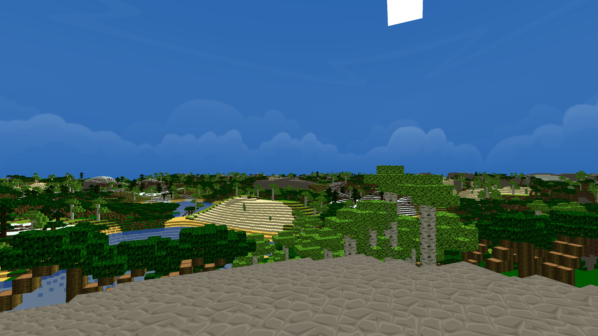

# Master-craft

The goal of this project is to realize a 3D voxel world represented only by 3D cubes in the spirit of **Minecraft**.

## Prerequisites

To run *Mastercraft*, you need:

* `CMake >= 3.7`
* `SDL2 >= 2.0.2`
* `OpenGL >= 3.3`
* `GLEW >= 2.1.0`


## Compilation

The compilation is done through `CMake` :

````bash
mkdir build
cd build
cmake ..
make
````

Compilation has been tested with `g++ = 10.2.0` and `clang++ = 11.0.0`.

The program is launch with the compiled executable `mastercraft`.

```
./mastercraft
```


## Manual


* Movement :

    * `W` : Move forward.
    * `S` : Move backward.
    * `A` : Strafe left.
    * `D` : Straft right.
    * `CTRL` : Move downward.
    * `SPACE` : Move upward.
    * Use the mouse to look around.

* Miscellaneous :

    * `ESC` To exit the application.
    * `E` To switch between day / night.
    * `F1` : Show/Hide debug menu.
    * `LEFT ALT` : Free mouse cursor.

Some notes :

* Controls should adapt to your keyboard layout.
* Disabling occlusion culling or increasing distance view a lot will heavily impact performance.
* Framerate may be overridden by your GPU / OpenGL configuration.


## Work done

* Infinite world built from 2D and 3D noises.
* Multiple biomes also generated from 2D noises.
* Multiple kind of tree.
* Transparent textures (water, leaves).
* Animated texture (water).
* Occlusion culling.
* Dynamic skybox.
* Dynamic lighting (sun's position, underwater).


## To do

* Loading SuperChunk on another thread (to avoid freeze on main loop)
* Frustum culling
* Fog to hide world's boundaries



